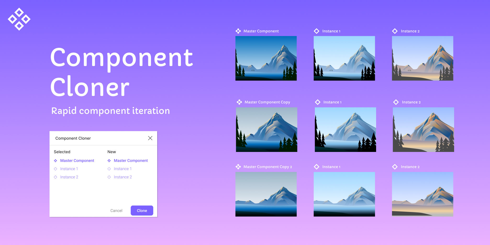

  

# Component Cloner
A figma plugin which allows users to clone component instances easily to a new master. Currently over 6k downloads!

## Featured on 
[Figma blog: 5 utility plugins to speed up your workflow
](https://www.figma.com/blog/five-utility-plugins-to-speed-up-your-workflow/)

[Medium article: The 15 best Figma plugins for designers (so far)](https://uxdesign.cc/the-15-best-figma-plugins-for-designers-so-far-84332ab1a61)

[YouTube video by Russian designer Андрей Жинжер](https://www.youtube.com/watch?v=DgYY7zroddo)

### Extra
I made this plugin since I thought it would be useful for myself and others. However I actually haven't been using Figma much recently, 
so I haven't been working on this as much. I will try to periodically check on this repository and merge in any changes. 

I've gotten several emails suggesting improvements and bug fixes so I want to make this public.

If people would like to help make this plugin even more useful, I would really appreciate it. Thanks!
